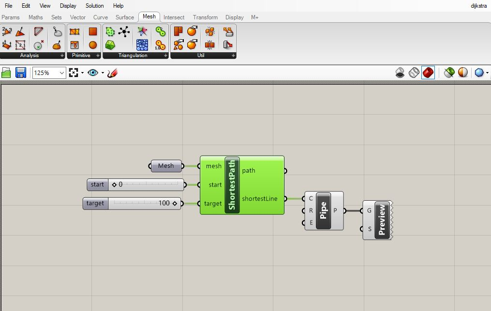
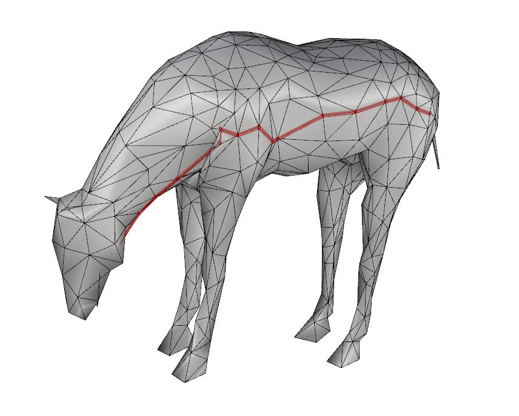
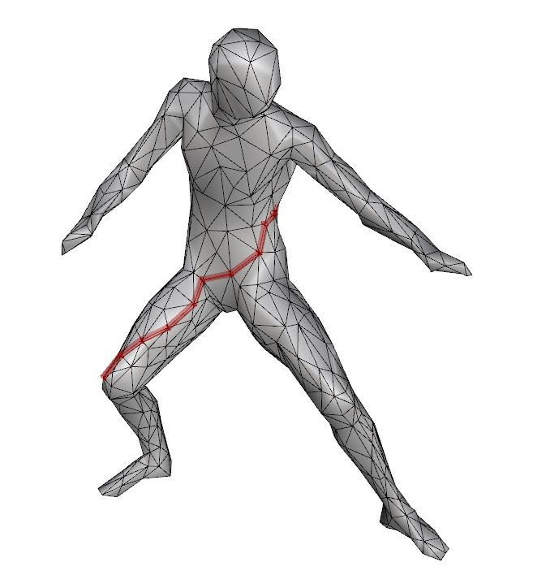

# Dijkstra Shortest Path algorithm for Grasshopper and Rhinoceros

Dijkstra algorithm aims to create the shortest path on mesh faces with respect to vertex information.

## Prerequisites

Rhinoceros v.5/v.6

IronPython >= 2.7.5

GHPython

## Installation

Open Rhinoceros and Grasshopper.

Drag **"Shortest_Path.ghuser"** file directly into the Grasshopper window.

Just in case the failure of installation in Rhinoceros v5., **"dijkstra_gh.py"** code can be copied into GHPython component.

## Usage

After installation, open Rhinoceros and Grasshopper.

Marching Cubes component will be under **Mesh > Triangulation**.

Decide the variables below and link them to the component: 

    mesh : One mesh

    start : A vertex index for starting point
    
    target : A vertex index for target point

Grasshopper pipe component can be linked to **shortestLine** output for a proper visualisation.
